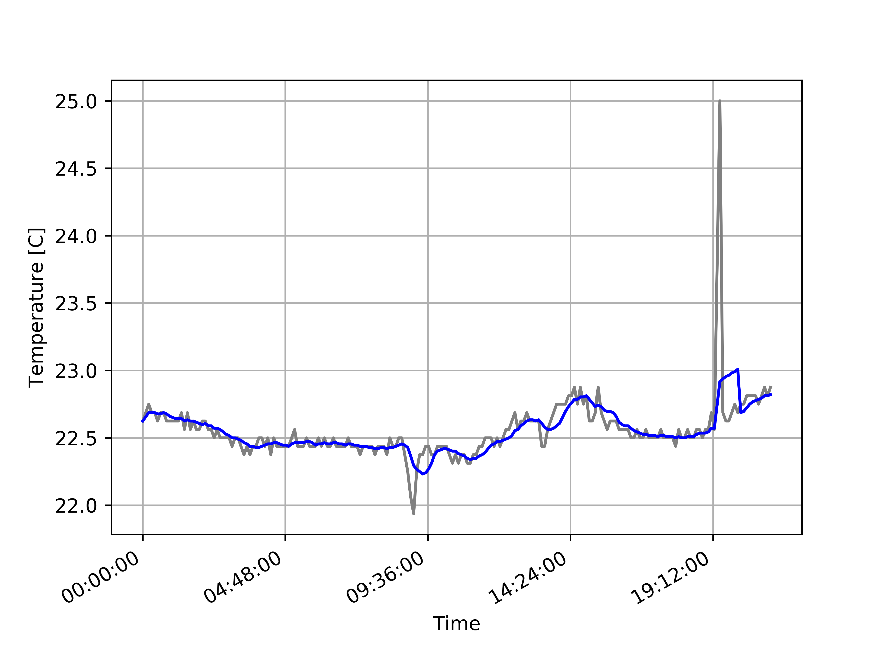

### C++ / Python code for handling ds18b20 senosor
- C++ code reads the temperature value and save it to file
- Python code creates daily graphs

### Install + Dependencies
#### C++:

```make all```

expected output:

```
gcc -g -o backup.o -c backup.cpp -std=c++20
gcc -g -o config.o -c config.cpp -std=c++20
gcc -g -o temperature.o -c temperature.cpp -std=c++20
gcc -g -o timeformat.o -c timeformat.cpp -std=c++20
gcc -g -o main.o -c main.cpp -std=c++20
gcc -g -o temperature.bin backup.o config.o temperature.o timeformat.o main.o -lstdc++ -lpthread
echo All done
All done
```

#### Python dependencies:

matplotlib (ideally version 2.0.2)

### Configuration
config.config file

### Ploting


