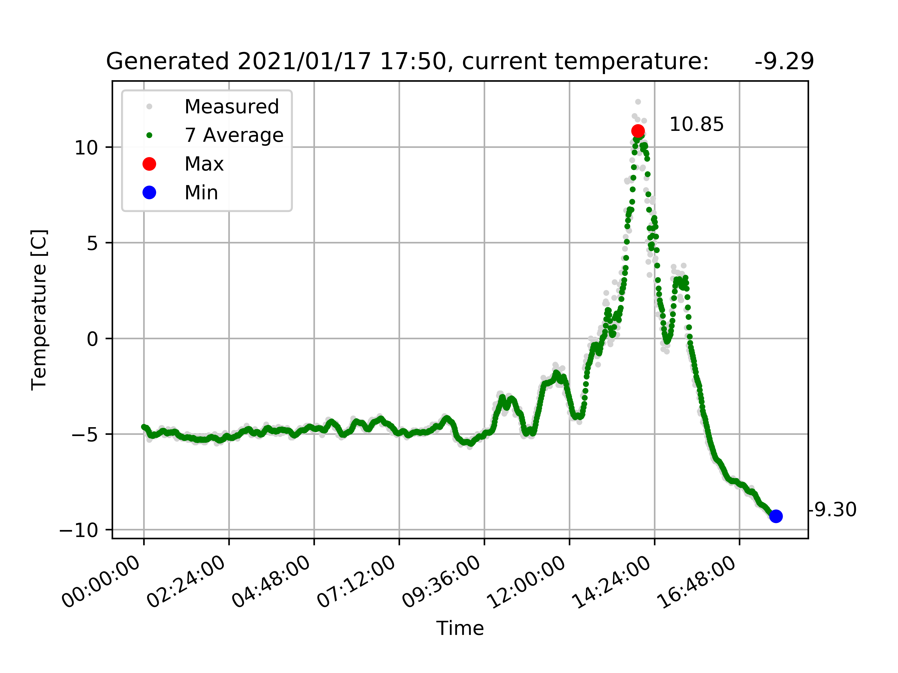

### C++ / Python code for handling ds18b20 senosor
- C++ code reads the temperature value and save it to file
- Python code creates daily graphs

### Install + Dependencies
#### C++:

```make -j4 all && ./run_tests.bin&```

expected output:

```
gcc -g -o backup.o -c backup.cpp -std=c++2a
gcc -g -o config.o -c config.cpp -std=c++2a
gcc -g -o temperature.o -c temperature.cpp -std=c++2a
gcc -g -o timeformat.o -c timeformat.cpp -std=c++2a
gcc -g -o parser.o -c parser.cpp -std=c++2a
gcc -g -o main.o -c main.cpp -std=c++2a
gcc -g -o temperature_unittest.o -c temperature_unittest.cpp -std=c++2a
gcc -g -o parser_unittest.o -c parser_unittest.cpp -std=c++2a
gcc -g -o unittest_main.o -c unittest_main.cpp -std=c++2a
gcc -g -o temperature.bin backup.o config.o temperature.o timeformat.o parser.o main.o -lstdc++ -lpthread
gcc -g -o run_tests.bin temperature_unittest.o parser_unittest.o temperature.o config.o timeformat.o parser.o unittest_main.o -lstdc++ -lpthread -lgtest
echo All done
All done

[==========] Running 5 tests from 2 test suites.
[----------] Global test environment set-up.
[----------] 2 tests from checkCRCTest
[ RUN      ] checkCRCTest.Positive
[       OK ] checkCRCTest.Positive (0 ms)
[ RUN      ] checkCRCTest.Negative
[       OK ] checkCRCTest.Negative (0 ms)
[----------] 2 tests from checkCRCTest (0 ms total)

[----------] 3 tests from ParserTest
[ RUN      ] ParserTest.parseTemperaturePositive
[       OK ] ParserTest.parseTemperaturePositive (0 ms)
[ RUN      ] ParserTest.parseTemperatureNegative
[       OK ] ParserTest.parseTemperatureNegative (0 ms)
[ RUN      ] ParserTest.config
[       OK ] ParserTest.config (0 ms)
[----------] 3 tests from ParserTest (0 ms total)

[----------] Global test environment tear-down
[==========] 5 tests from 2 test suites ran. (0 ms total)
[  PASSED  ] 5 tests.
```

#### Python dependencies:

matplotlib (ideally version 2.0.2)

### Configuration
config.config file

### Ploting


